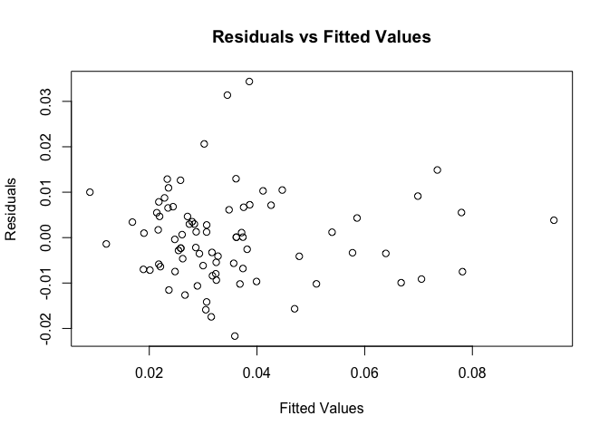

Lab 3: Linear Regression
================
Farwa Bhatti
Deepa Borkar
Justin Hsia
November 20, 2019

## 1. Introduction

The team is tasked to carry out research for a political campaign
through a dataset of crime statistics for a selection of counties in
North Carolina. Using statistical modeling approach, the team aims to
explore the determinants of crime for the given selection of counties in
North Carolina, and suggest applicable policies which will be helpful to
the local government to reduce crime. The following research question
and the supplementary questions will guide the recommendations and lead
to an actionable policy.

*Research Question*: What factors affect the crime rate for the given
selection of counties in North Carolina?

*Supplementary research questions to support the modeling process*:

1.  What factors , potentially controlled by the local government,
    affect the crime rate?

2.  What factors, which are important but may not be controlled by the
    local government, affect the crime rate?

3.  What is the magnitude effect of these factors, that is, are some
    factors more important than others in contributing to the crime
    rate?

4.  Do these results vary by region, area, type of criminal activity
    etc?

Throughout the rest of our report, our objective is to best answer the
main research question and to provide as much statistical evidence and
support for the supplementary research questions. However given the
scope of the project and the limitations of the dataset, we may only be
able to answer some of those questions. The end goal is to provide the
policy makers with actionable insights that they will be able to
implement to control the crime rate in North Carolina.

 

## 2. Exploratory Data Analysis

**Variables**: The dataset has 25 variables, with ***crmrte - crimes
committed per person*** being the dependent variable in our statistical
models. Before we start brainstorming on the modelling approaches, it is
important to validate and explore the variables of interest from the
dataset, and to detect and correct the possibly inaccurate, incomplete
or irrelevant records from the dataset.

``` r
C = read.csv('crime_v2.csv')

# Dimension of the database
dim(C)
```

    ## [1] 97 25

``` r
# Objects of the databse
ls(C)
```

    ##  [1] "avgsen"   "central"  "county"   "crmrte"   "density"  "mix"     
    ##  [7] "pctmin80" "pctymle"  "polpc"    "prbarr"   "prbconv"  "prbpris" 
    ## [13] "taxpc"    "urban"    "wcon"     "west"     "wfed"     "wfir"    
    ## [19] "wloc"     "wmfg"     "wser"     "wsta"     "wtrd"     "wtuc"    
    ## [25] "year"

 

**Missing data**: The data initially had 97 rows and 25 columns.
However, further looking into the data, we observed about 6 rows with no
data labeled as “NA”, which also impacted some of the initial summary
statistics. The missing data was deleted from the final dataset which
will be used for modelling purposes. It is important to note that
normally if we had some observations missing from the dataset, we would
have used some extrapolation/imputation techniques for those missing
values but given that we have 6 entire rows of NAs with no added
information in them, we have decided that in order to improve the
quality of the data and to derive meaningful insights from the EDA, it
is okay to omit those rows.

``` r
# Summary of the database
summary(C)
```

    ##      county           year        crmrte             prbarr       
    ##  Min.   :  1.0   Min.   :87   Min.   :0.005533   Min.   :0.09277  
    ##  1st Qu.: 52.0   1st Qu.:87   1st Qu.:0.020927   1st Qu.:0.20568  
    ##  Median :105.0   Median :87   Median :0.029986   Median :0.27095  
    ##  Mean   :101.6   Mean   :87   Mean   :0.033400   Mean   :0.29492  
    ##  3rd Qu.:152.0   3rd Qu.:87   3rd Qu.:0.039642   3rd Qu.:0.34438  
    ##  Max.   :197.0   Max.   :87   Max.   :0.098966   Max.   :1.09091  
    ##  NA's   :6       NA's   :6    NA's   :6          NA's   :6        
    ##    prbconv             prbpris           avgsen           polpc         
    ##  Length:97          Min.   :0.1500   Min.   : 5.380   Min.   :0.000746  
    ##  Class :character   1st Qu.:0.3648   1st Qu.: 7.340   1st Qu.:0.001231  
    ##  Mode  :character   Median :0.4234   Median : 9.100   Median :0.001485  
    ##                     Mean   :0.4108   Mean   : 9.647   Mean   :0.001702  
    ##                     3rd Qu.:0.4568   3rd Qu.:11.420   3rd Qu.:0.001877  
    ##                     Max.   :0.6000   Max.   :20.700   Max.   :0.009054  
    ##                     NA's   :6        NA's   :6        NA's   :6         
    ##     density            taxpc             west           central      
    ##  Min.   :0.00002   Min.   : 25.69   Min.   :0.0000   Min.   :0.0000  
    ##  1st Qu.:0.54741   1st Qu.: 30.66   1st Qu.:0.0000   1st Qu.:0.0000  
    ##  Median :0.96226   Median : 34.87   Median :0.0000   Median :0.0000  
    ##  Mean   :1.42884   Mean   : 38.06   Mean   :0.2527   Mean   :0.3736  
    ##  3rd Qu.:1.56824   3rd Qu.: 40.95   3rd Qu.:0.5000   3rd Qu.:1.0000  
    ##  Max.   :8.82765   Max.   :119.76   Max.   :1.0000   Max.   :1.0000  
    ##  NA's   :6         NA's   :6        NA's   :6        NA's   :6       
    ##      urban            pctmin80           wcon            wtuc      
    ##  Min.   :0.00000   Min.   : 1.284   Min.   :193.6   Min.   :187.6  
    ##  1st Qu.:0.00000   1st Qu.: 9.845   1st Qu.:250.8   1st Qu.:374.6  
    ##  Median :0.00000   Median :24.312   Median :281.4   Median :406.5  
    ##  Mean   :0.08791   Mean   :25.495   Mean   :285.4   Mean   :411.7  
    ##  3rd Qu.:0.00000   3rd Qu.:38.142   3rd Qu.:314.8   3rd Qu.:443.4  
    ##  Max.   :1.00000   Max.   :64.348   Max.   :436.8   Max.   :613.2  
    ##  NA's   :6         NA's   :6        NA's   :6       NA's   :6      
    ##       wtrd            wfir            wser             wmfg      
    ##  Min.   :154.2   Min.   :170.9   Min.   : 133.0   Min.   :157.4  
    ##  1st Qu.:190.9   1st Qu.:286.5   1st Qu.: 229.7   1st Qu.:288.9  
    ##  Median :203.0   Median :317.3   Median : 253.2   Median :320.2  
    ##  Mean   :211.6   Mean   :322.1   Mean   : 275.6   Mean   :335.6  
    ##  3rd Qu.:225.1   3rd Qu.:345.4   3rd Qu.: 280.5   3rd Qu.:359.6  
    ##  Max.   :354.7   Max.   :509.5   Max.   :2177.1   Max.   :646.9  
    ##  NA's   :6       NA's   :6       NA's   :6        NA's   :6      
    ##       wfed            wsta            wloc            mix         
    ##  Min.   :326.1   Min.   :258.3   Min.   :239.2   Min.   :0.01961  
    ##  1st Qu.:400.2   1st Qu.:329.3   1st Qu.:297.3   1st Qu.:0.08074  
    ##  Median :449.8   Median :357.7   Median :308.1   Median :0.10186  
    ##  Mean   :442.9   Mean   :357.5   Mean   :312.7   Mean   :0.12884  
    ##  3rd Qu.:478.0   3rd Qu.:382.6   3rd Qu.:329.2   3rd Qu.:0.15175  
    ##  Max.   :598.0   Max.   :499.6   Max.   :388.1   Max.   :0.46512  
    ##  NA's   :6       NA's   :6       NA's   :6       NA's   :6        
    ##     pctymle       
    ##  Min.   :0.06216  
    ##  1st Qu.:0.07443  
    ##  Median :0.07771  
    ##  Mean   :0.08396  
    ##  3rd Qu.:0.08350  
    ##  Max.   :0.24871  
    ##  NA's   :6

``` r
# First six sample points
head(C)
```

    ##   county year    crmrte   prbarr     prbconv  prbpris avgsen      polpc
    ## 1      1   87 0.0356036 0.298270 0.527595997 0.436170   6.71 0.00182786
    ## 2      3   87 0.0152532 0.132029 1.481480002 0.450000   6.35 0.00074588
    ## 3      5   87 0.0129603 0.444444 0.267856985 0.600000   6.76 0.00123431
    ## 4      7   87 0.0267532 0.364760 0.525424004 0.435484   7.14 0.00152994
    ## 5      9   87 0.0106232 0.518219 0.476563007 0.442623   8.22 0.00086018
    ## 6     11   87 0.0146067 0.524664 0.068376102 0.500000  13.00 0.00288203
    ##     density    taxpc west central urban pctmin80     wcon     wtuc     wtrd
    ## 1 2.4226327 30.99368    0       1     0 20.21870 281.4259 408.7245 221.2701
    ## 2 1.0463320 26.89208    0       1     0  7.91632 255.1020 376.2542 196.0101
    ## 3 0.4127659 34.81605    1       0     0  3.16053 226.9470 372.2084 229.3209
    ## 4 0.4915572 42.94759    0       1     0 47.91610 375.2345 397.6901 191.1720
    ## 5 0.5469484 28.05474    1       0     0  1.79619 292.3077 377.3126 206.8215
    ## 6 0.6113361 35.22974    1       0     0  1.54070 250.4006 401.3378 187.8255
    ##       wfir     wser   wmfg   wfed   wsta   wloc        mix    pctymle
    ## 1 453.1722 274.1775 334.54 477.58 292.09 311.91 0.08016878 0.07787097
    ## 2 258.5650 192.3077 300.38 409.83 362.96 301.47 0.03022670 0.08260694
    ## 3 305.9441 209.6972 237.65 358.98 331.53 281.37 0.46511629 0.07211538
    ## 4 281.0651 256.7214 281.80 412.15 328.27 299.03 0.27362204 0.07353726
    ## 5 289.3125 215.1933 290.89 377.35 367.23 342.82 0.06008584 0.07069755
    ## 6 258.5650 237.1507 258.60 391.48 325.71 275.22 0.31952664 0.09891920

``` r
# Last six sample points
tail(C)
```

    ##    county year crmrte prbarr prbconv prbpris avgsen polpc density taxpc west
    ## 92     NA   NA     NA     NA              NA     NA    NA      NA    NA   NA
    ## 93     NA   NA     NA     NA              NA     NA    NA      NA    NA   NA
    ## 94     NA   NA     NA     NA              NA     NA    NA      NA    NA   NA
    ## 95     NA   NA     NA     NA              NA     NA    NA      NA    NA   NA
    ## 96     NA   NA     NA     NA              NA     NA    NA      NA    NA   NA
    ## 97     NA   NA     NA     NA       `      NA     NA    NA      NA    NA   NA
    ##    central urban pctmin80 wcon wtuc wtrd wfir wser wmfg wfed wsta wloc mix
    ## 92      NA    NA       NA   NA   NA   NA   NA   NA   NA   NA   NA   NA  NA
    ## 93      NA    NA       NA   NA   NA   NA   NA   NA   NA   NA   NA   NA  NA
    ## 94      NA    NA       NA   NA   NA   NA   NA   NA   NA   NA   NA   NA  NA
    ## 95      NA    NA       NA   NA   NA   NA   NA   NA   NA   NA   NA   NA  NA
    ## 96      NA    NA       NA   NA   NA   NA   NA   NA   NA   NA   NA   NA  NA
    ## 97      NA    NA       NA   NA   NA   NA   NA   NA   NA   NA   NA   NA  NA
    ##    pctymle
    ## 92      NA
    ## 93      NA
    ## 94      NA
    ## 95      NA
    ## 96      NA
    ## 97      NA

``` r
# Remove last six sample points for they hold no values
newC = C[1:91,]
```

 

**Conversion of a variable**: It was also observed that the variable
prbconv was a factor, and therefore the variable was converted from a
factor to a numerical vector.

``` r
# Check class of prbconv
class(newC$prbconv)
```

    ## [1] "character"

``` r
# Convert prbconv to a numerical vector
newC$prbconv = as.numeric(newC$prbconv)
```

 

**Inaccurate observations**: There are also some probability variables
which we further investigated to ensure that their values are in line
with the definitions provided.

-   ***prbarr - the probability of arrest*** - is the ratio of arrests
    to offenses.

-   ***prbconv - the probability of conviction*** - is the ratio of
    convictions to arrests

-   ***prbpris - the probability of prison*** - ratio of convictions
    resulting in prison sentence to total convictions.

Given that these variables are probabilities and their values should
reside between 0 and 1; we saw some observations where the values of
these variables were greater than 1, and require deeper analysis as to
how these values were computed. One observation in ***prbarr*** and ten
entries in ***prbconv*** have probabilities greater than 0. We believe
either there are mistakes in the database or there may be need to study
these variables in greater detail. Sticking to the definition of these
variables as ***“probabilities”*** and limiting the scope of the project
provided, any probability values greater than 1 can be interpreted as
incorrect (or skewed) and will be removed from the dataset.

``` r
length(newC$prbarr[newC$prbarr > 1])
```

    ## [1] 1

``` r
length(newC$prbconv[newC$prbconv > 1])
```

    ## [1] 10

``` r
length(newC$prbpris[newC$prbpris > 1])
```

    ## [1] 0

``` r
# Filter out entries with probabilities that are greater than 1.
filter = newC$prbarr <= 1 & newC$prbconv <= 1 & newC$prbpris <= 1
filterC = newC[filter,]
```

 

**Correlation Matrix**: In order to understand the statistical
associations of all of our variables, and which ones can potentially be
the explanatory variables when we build our statistical models, we
mapped out a correlation heat map matrix. As highlighted in the
**Exhibit EDA1: Correlation Heat Map Matrix** below, the red-to-orange
toned variables are negatively correlated and the blue-to-dark blue
toned variables are positively correlated. The size and the color
determine the magnitude of the correlation coefficient.

The two variables which in comparison to the other variables, have a
higher correlation with the crime rate are *density* (population
density) and *polpc* (police per capita). The correlation coefficients
are 0.72 and 0.48, respectively. However, there are also some variables
which are negatively correlated to *crmrte*, such as *prbconv*
(probability of conviction) and *prbarr* (probability of arrest). The
negative correlation coefficients are not very strong, and are -0.3 and
-0.5 for *prbconv* and *prbarr*, respectively. Out of all the variables,
population density has the strongest correlation and may also be one of
the most important explanatory variables from the dataset.

<!-- -->

 

**Summary Statistics**: After the aforementioned changes, the
filtered/cleaned dataset has a total of 81 rows and 25 variables, and
all probability variables now have values less than or equal to 1. For
the rest of the analysis and the model building, we will use the cleaned
dataset.

Our primary variable of interest given the research question is
*crmrte*, which is crimes committed per person in each county. The focus
is via modeling approaches, we discover any causal or associative
relations between the dependent variable *crmrte* and other variables.

    ##      county            year        crmrte            prbarr       
    ##  Min.   :  1.00   Min.   :87   Min.   :0.01062   Min.   :0.09277  
    ##  1st Qu.: 51.00   1st Qu.:87   1st Qu.:0.02337   1st Qu.:0.22154  
    ##  Median : 97.00   Median :87   Median :0.03043   Median :0.28733  
    ##  Mean   : 99.02   Mean   :87   Mean   :0.03536   Mean   :0.29673  
    ##  3rd Qu.:151.00   3rd Qu.:87   3rd Qu.:0.04374   3rd Qu.:0.35035  
    ##  Max.   :193.00   Max.   :87   Max.   :0.09897   Max.   :0.68902  
    ##     prbconv           prbpris           avgsen           polpc          
    ##  Min.   :0.06838   Min.   :0.1500   Min.   : 5.450   Min.   :0.0007559  
    ##  1st Qu.:0.33470   1st Qu.:0.3704   1st Qu.: 7.360   1st Qu.:0.0012482  
    ##  Median :0.43896   Median :0.4234   Median : 8.960   Median :0.0014782  
    ##  Mean   :0.44824   Mean   :0.4121   Mean   : 9.362   Mean   :0.0016102  
    ##  3rd Qu.:0.52760   3rd Qu.:0.4552   3rd Qu.:11.110   3rd Qu.:0.0018574  
    ##  Max.   :0.97297   Max.   :0.6000   Max.   :17.410   Max.   :0.0040096  
    ##     density            taxpc             west           central      
    ##  Min.   :0.00002   Min.   : 25.69   Min.   :0.0000   Min.   :0.0000  
    ##  1st Qu.:0.56397   1st Qu.: 30.85   1st Qu.:0.0000   1st Qu.:0.0000  
    ##  Median :1.00528   Median : 34.87   Median :0.0000   Median :0.0000  
    ##  Mean   :1.50837   Mean   : 38.04   Mean   :0.2346   Mean   :0.3951  
    ##  3rd Qu.:1.59396   3rd Qu.: 40.80   3rd Qu.:0.0000   3rd Qu.:1.0000  
    ##  Max.   :8.82765   Max.   :119.76   Max.   :1.0000   Max.   :1.0000  
    ##      urban            pctmin80           wcon            wtuc      
    ##  Min.   :0.00000   Min.   : 1.541   Min.   :193.6   Min.   :187.6  
    ##  1st Qu.:0.00000   1st Qu.:10.084   1st Qu.:250.8   1st Qu.:375.2  
    ##  Median :0.00000   Median :25.391   Median :283.7   Median :406.5  
    ##  Mean   :0.09877   Mean   :25.774   Mean   :287.9   Mean   :410.9  
    ##  3rd Qu.:0.00000   3rd Qu.:38.636   3rd Qu.:315.7   3rd Qu.:445.3  
    ##  Max.   :1.00000   Max.   :61.942   Max.   :436.8   Max.   :595.4  
    ##       wtrd            wfir            wser            wmfg      
    ##  Min.   :154.2   Min.   :234.5   Min.   :133.0   Min.   :157.4  
    ##  1st Qu.:192.9   1st Qu.:288.5   1st Qu.:230.3   1st Qu.:290.7  
    ##  Median :205.5   Median :317.3   Median :253.6   Median :320.2  
    ##  Mean   :213.1   Mean   :322.6   Mean   :255.2   Mean   :335.7  
    ##  3rd Qu.:225.5   3rd Qu.:340.0   3rd Qu.:278.1   3rd Qu.:358.9  
    ##  Max.   :354.7   Max.   :509.5   Max.   :391.3   Max.   :646.9  
    ##       wfed            wsta            wloc            mix         
    ##  Min.   :326.1   Min.   :267.8   Min.   :239.2   Min.   :0.05092  
    ##  1st Qu.:406.6   1st Qu.:329.4   1st Qu.:297.1   1st Qu.:0.08437  
    ##  Median :451.8   Median :357.7   Median :308.3   Median :0.10368  
    ##  Mean   :445.2   Mean   :359.5   Mean   :312.1   Mean   :0.13580  
    ##  3rd Qu.:478.5   3rd Qu.:383.7   3rd Qu.:329.2   3rd Qu.:0.16323  
    ##  Max.   :598.0   Max.   :499.6   Max.   :388.1   Max.   :0.46512  
    ##     pctymle       
    ##  Min.   :0.06356  
    ##  1st Qu.:0.07522  
    ##  Median :0.07795  
    ##  Mean   :0.08455  
    ##  3rd Qu.:0.08356  
    ##  Max.   :0.24871

 

**EXPLORING VARIABLES WITH UNIVARIATE ANALYSIS- DENSITY**: For the
univariate analysis, between population and crime rate, we observe that
the model achieves R-squared of about 52% with a statistically
significant coefficient. One unit increase in population density
increases the crime rate by 0.009 units. It is also observed that the
density histogram is positively skewed, however we may assume normality
given the number of observations in the dataset for linear regression
models.

<!-- --><!-- -->

    ## [1] 0.524631

    ## 
    ## ===============================================
    ##                         Dependent variable:    
    ##                     ---------------------------
    ##                               crmrte           
    ## -----------------------------------------------
    ## density                      0.009***          
    ##                               (0.001)          
    ##                                                
    ## Constant                     0.022***          
    ##                               (0.002)          
    ##                                                
    ## -----------------------------------------------
    ## Observations                    81             
    ## R2                             0.525           
    ## Adjusted R2                    0.519           
    ## Residual Std. Error       0.013 (df = 79)      
    ## F Statistic           87.187*** (df = 1; 79)   
    ## ===============================================
    ## Note:               *p<0.1; **p<0.05; ***p<0.01

 

**EXPLORING VARIABLES WITH UNIVARIATE ANALYSIS- POLPC**: For the second
univariate analysis, between police per capita and crime rate, we
observe that the model achieves R-squared of about 31% with a
statistically significant coefficient. We also observe the magnitude of
this coefficient to be high which can either over power the model
results, or it is due to the difference in the per capita unit. We may
also assume normality in the histogram for *polpc*.

<!-- --><!-- -->

    ## [1] 0.3172609

    ## 
    ## ===============================================
    ##                         Dependent variable:    
    ##                     ---------------------------
    ##                               crmrte           
    ## -----------------------------------------------
    ## polpc                        19.822***         
    ##                               (3.272)          
    ##                                                
    ## Constant                       0.003           
    ##                               (0.006)          
    ##                                                
    ## -----------------------------------------------
    ## Observations                    81             
    ## R2                             0.317           
    ## Adjusted R2                    0.309           
    ## Residual Std. Error       0.016 (df = 79)      
    ## F Statistic           36.710*** (df = 1; 79)   
    ## ===============================================
    ## Note:               *p<0.1; **p<0.05; ***p<0.01

 

**ISSUES WITH MULTICOLLINEARITY**: We ensure before we start the
modelling approaches, that the variables we choose, (*density, polpc,
ymlepsq*) are not correlated to one another. We will define variable,
**ymlepsq**, in the next section.

 

**MODEL1 WITH EXPLANATORY VARIABLE:**

The first model finalized uses the following variables:

-   **ymlepsq** - we transformed the existing two variables, **pctymle**
    (percent young male) and the **density** (people per square mile) to
    create this new variable which is the percent of young male per
    square mile in the population.

-   **polpc** - The second variable used in the regression model is the
    **polpc**, which is the police per capita

-   **taxpc** - The third variable we used in the model is the tax
    revenue per capita

We selected these three independent variables to explain the criminal
activity, with the hypothesis that there is a significant relationship
between the percent of young males per capita in the population, police
presence, tax revenue and the crime rate.

According to the results below, the model has achieved a good R-squared,
about 68.7% of the crime rate is explained by the young males per square
mile, the police per capita and tax revenue independent variables in the
linear model. The coefficients show that they are statistically
significant. Taking a look at the residuals which tells us the distance
from the line at 0 is how bad the prediction was for that value. We see
some values which are greater than 0.02, which are some outlier values
from the predicted values. The maximum residual we observed was 0.04.

<!-- -->

    ## [1] 0.6870196

    ## 
    ## ===============================================
    ##                         Dependent variable:    
    ##                     ---------------------------
    ##                               crmrte           
    ## -----------------------------------------------
    ## ymlepsq                      0.084***          
    ##                               (0.009)          
    ##                                                
    ## polpc                         6.603**          
    ##                               (2.946)          
    ##                                                
    ## taxpc                        0.0003**          
    ##                              (0.0001)          
    ##                                                
    ## Constant                       0.003           
    ##                               (0.004)          
    ##                                                
    ## -----------------------------------------------
    ## Observations                    81             
    ## R2                             0.687           
    ## Adjusted R2                    0.675           
    ## Residual Std. Error       0.011 (df = 77)      
    ## F Statistic           56.341*** (df = 3; 77)   
    ## ===============================================
    ## Note:               *p<0.1; **p<0.05; ***p<0.01

    ## [1] -498.5736

 

**MODEL 2A WITH EXPLANATORY VARIABLE AND COVARIATES:**

The second model finalized uses the variables from model 1 and we added
the following covariate: \* *prbarr* - probability of arrest

According to the results below, the model has achieved a good R-squared,
about 73.0% of the crime rate is explained by the young males per square
mile, the police per capita and tax revenue, and the covariate
probability of arrest. The coefficients show that they are statistically
significant. Taking a look at the residuals, we see some values which
are greater than 0.02, which are some outlier values from the predicted
values. The maximum residual we observed was 0.035.

<!-- -->

    ## [1] 0.7300463

    ## 
    ## ===============================================
    ##                         Dependent variable:    
    ##                     ---------------------------
    ##                               crmrte           
    ## -----------------------------------------------
    ## ymlepsq                      0.071***          
    ##                               (0.009)          
    ##                                                
    ## polpc                         6.923**          
    ##                               (2.756)          
    ##                                                
    ## taxpc                        0.0003**          
    ##                              (0.0001)          
    ##                                                
    ## prbarr                       -0.040***         
    ##                               (0.011)          
    ##                                                
    ## Constant                     0.016***          
    ##                               (0.005)          
    ##                                                
    ## -----------------------------------------------
    ## Observations                    81             
    ## R2                             0.730           
    ## Adjusted R2                    0.716           
    ## Residual Std. Error       0.010 (df = 76)      
    ## F Statistic           51.382*** (df = 4; 76)   
    ## ===============================================
    ## Note:               *p<0.1; **p<0.05; ***p<0.01

    ## [1] -508.5527

 

**MODEL 2B WITH EXPLANATORY VARIABLE AND COVARIATES:** We added the
probability of conviction in the model to understand how the results
change or improve. The results show that the R-squared doesn’t improve
much and adding the probability of conviction does not yield a
statistically significant coefficient either.

According to the results below, the model R-squared remains steady as
Model 2A, about 73.0% of the crime rate is explained by the young males
per square mile, the police per capita and tax revenue, and the
covariate probability of arrest and conviction. Taking a look at the
residuals, we see some values which are greater than 0.02, which are
some outlier values from the predicted values. The maximum residual we
observed was 0.034.

<!-- -->

    ## [1] 0.7331209

    ## 
    ## ===============================================
    ##                         Dependent variable:    
    ##                     ---------------------------
    ##                               crmrte           
    ## -----------------------------------------------
    ## ymlepsq                      0.069***          
    ##                               (0.010)          
    ##                                                
    ## polpc                         6.181**          
    ##                               (2.871)          
    ##                                                
    ## taxpc                        0.0003**          
    ##                              (0.0001)          
    ##                                                
    ## prbarr                       -0.043***         
    ##                               (0.012)          
    ##                                                
    ## prbconv                       -0.007           
    ##                               (0.008)          
    ##                                                
    ## Constant                     0.022***          
    ##                               (0.008)          
    ##                                                
    ## -----------------------------------------------
    ## Observations                    81             
    ## R2                             0.733           
    ## Adjusted R2                    0.715           
    ## Residual Std. Error       0.010 (df = 75)      
    ## F Statistic           41.205*** (df = 5; 75)   
    ## ===============================================
    ## Note:               *p<0.1; **p<0.05; ***p<0.01

    ## [1] -507.4805

 

**MODEL 3 WITH EXPLANATORY VARIABLE AND ALL COVARIATES:** In this model,
we will look at the effect that adding all covariates have on the model.
In particular, we are adding on the covariates *prbpris* and *totalwg*
to the previous model. The variable *prbpris*, similar to *prbconv*, has
little to no effect on the model. The variable *totalwg* is a
transformed variable that adds up all of the weekly wages in the county
in order to understand how the income or affluency of the county affects
crime rate.

According to the information below, the R-squared value is very high at
74.13%, meaning that approximately 74% of crime rate can be attributed
to young males per square mile, police per capita, tax revenue per
capita, probability of arrests, probability of convictions, probability
of prison sentence, and total wages. This value is similar to the
R-squared values from Model 2, which demonstrates that Model 2
exemplifies the best determinants of crime. The minimal change in
R-squared shows the robustness of the model.

<!-- -->

    ## [1] 0.7412601

    ## 
    ## ===============================================
    ##                         Dependent variable:    
    ##                     ---------------------------
    ##                               crmrte           
    ## -----------------------------------------------
    ## ymlepsq                      0.072***          
    ##                               (0.012)          
    ##                                                
    ## polpc                         7.022**          
    ##                               (2.919)          
    ##                                                
    ## taxpc                        0.0003**          
    ##                              (0.0001)          
    ##                                                
    ## prbarr                       -0.043***         
    ##                               (0.012)          
    ##                                                
    ## prbconv                       -0.005           
    ##                               (0.008)          
    ##                                                
    ## prbpris                        0.021           
    ##                               (0.015)          
    ##                                                
    ## totalwg                      -0.00000          
    ##                              (0.00000)         
    ##                                                
    ## Constant                       0.019           
    ##                               (0.016)          
    ##                                                
    ## -----------------------------------------------
    ## Observations                    81             
    ## R2                             0.741           
    ## Adjusted R2                    0.716           
    ## Residual Std. Error       0.010 (df = 73)      
    ## F Statistic           29.877*** (df = 7; 73)   
    ## ===============================================
    ## Note:               *p<0.1; **p<0.05; ***p<0.01

    ## [1] -505.9893

We can then take a closer look at this model by looking at how the model
changes from suburban and urban areas. This will help us understand if
there is a difference in crime rate between the two regions. To
determine if an area is considered urban or suburban, we took a look at
the urban variable. If the value of the urban variable was 1, we
considered that county urban. If the urban variable was 0, we considered
that county suburban.

We used a two-sided independent t-test to compare the mean crime rate
between urban and suburban areas. The null hypothesis would be that the
average crime rate in urban areas is equal to the average crime rate in
suburban areas, and the alternative hypothesis is that these average
crime rates are not equal. Since we get a p-value of less than 0.01, we
can reject the null hypothesis with high statistical significance and
large practical significance.

    ## 
    ##  Welch Two Sample t-test
    ## 
    ## data:  filterSuburban$crmrte and filterUrban$crmrte
    ## t = -5.7807, df = 7.9715, p-value = 0.0004197
    ## alternative hypothesis: true difference in means is not equal to 0
    ## 95 percent confidence interval:
    ##  -0.05453889 -0.02342056
    ## sample estimates:
    ##  mean of x  mean of y 
    ## 0.03151455 0.07049427

    ## 
    ## Cohen's d
    ## 
    ## d estimate: 2.621249 (large)
    ## 95 percent confidence interval:
    ##    lower    upper 
    ## 1.774168 3.468330

 

**MODEL 3A WITH EXPLANATORY VARIABLE AND COVARIATES FOR SUBURBAN
AREAS:** For this model, we will look at how the explanatory variables
and all the covariates affect crime rate specifically in suburban areas.
This model is not as strong as our previous models because the R-squared
value is 54.7%.

<!-- -->

    ## [1] 0.5472391

    ## 
    ## ===============================================
    ##                         Dependent variable:    
    ##                     ---------------------------
    ##                               crmrte           
    ## -----------------------------------------------
    ## ymlepsq                      0.075***          
    ##                               (0.021)          
    ##                                                
    ## polpc                         7.319**          
    ##                               (3.061)          
    ##                                                
    ## taxpc                        0.0003**          
    ##                              (0.0001)          
    ##                                                
    ## prbarr                       -0.041***         
    ##                               (0.013)          
    ##                                                
    ## prbconv                       -0.004           
    ##                               (0.008)          
    ##                                                
    ## prbpris                        0.023           
    ##                               (0.016)          
    ##                                                
    ## totalwg                      -0.00000          
    ##                              (0.00001)         
    ##                                                
    ## Constant                       0.013           
    ##                               (0.018)          
    ##                                                
    ## -----------------------------------------------
    ## Observations                    73             
    ## R2                             0.547           
    ## Adjusted R2                    0.498           
    ## Residual Std. Error       0.010 (df = 65)      
    ## F Statistic           11.223*** (df = 7; 65)   
    ## ===============================================
    ## Note:               *p<0.1; **p<0.05; ***p<0.01

    ## [1] -452.0525

 

**MODEL 3B WITH EXPLANATORY VARIABLE AND COVARIATES FOR URBAN AREAS:**
For this model, we will look at how all the variables affect crime rates
in urban areas. Because the sample size is only 8 counties, we do not
have enough data to make conclusive statements of urban areas
specifically. However, these are areas where we should continue to
monitor and collect data on because as found from the t-test, we can see
that there is a higher crime rate in urban areas over suburban areas.

<!-- -->

    ## [1] 1

    ## 
    ## ========================================
    ##                  Dependent variable:    
    ##              ---------------------------
    ##                        crmrte           
    ## ----------------------------------------
    ## ymlepsq                -0.041           
    ##                                         
    ##                                         
    ## polpc                  50.736           
    ##                                         
    ##                                         
    ## taxpc                   0.003           
    ##                                         
    ##                                         
    ## prbarr                 -0.583           
    ##                                         
    ##                                         
    ## prbconv                -0.512           
    ##                                         
    ##                                         
    ## prbpris                -0.601           
    ##                                         
    ##                                         
    ## totalwg               -0.00002          
    ##                                         
    ##                                         
    ## Constant                0.451           
    ##                                         
    ##                                         
    ## ----------------------------------------
    ## Observations              8             
    ## R2                      1.000           
    ## ========================================
    ## Note:        *p<0.1; **p<0.05; ***p<0.01

    ## [1] -Inf

 

**Omitted Variables:** The variables that we have chosen to omit are
*year*, *avgsen*, *west*, *central*, *pctmin80*, and *mix* because these
variables have shown not to affect the crime rate.

The variable *year* is not used because this remains constant at the
value 1987 for all rows. The variables *west* and *central* were not
used because there were some counties that were not classified as either
west or central so there was not an easy way to determine where these
counties were regionally. Because regions could not be determined for
all counties, the *west* and *central* variables were omitted from the
models.

The variables *avgsen*, *mix*, and *pctmin80* are also not used because
these variables had little to no effect on the crime rate. This can be
shown by looking at the R-squared value when correlating the variables
with *crmrte*. The R-squared values are very close to 0 indicating that
these variables have little to no effect on the crime rate.

    ## [1] 0.0207794

    ## [1] 0.1124587

    ## [1] 0.02509051

    ## [1] 0.03285647

    ## [1] 0.05402836

| Variable | $R^2$   |
|----------|---------|
| avgsen   | 0.02078 |
| west     | 0.11246 |
| central  | 0.02509 |
| pctmin80 | 0.03286 |
| mix      | 0.05403 |

Although mix is an omitted variable in the model specifications, we can
still use this variable to analyze in more detail crime rate and total
wages.

<!-- -->

<!-- -->

The first graph shows that as total wage increases crime rate also
increases. This means that there is more crime in more affluent areas.
This seems contrary to common conceptions, so we also looked at the
relationship between total wage and face-to-face crimes. From the graph
of mix vs total wage, we can see that more face-to-face crimes, such as
robberies, happen in less affluent areas. So, although there is a higher
crime rate in wealthier areas, there are more face-to-face crimes in
lower income areas.

 

## 3. Conclusion

In conclusion, we can take our analysis to determine which policies
would help decrease crime rate in North Carolina. There are 3 major
policies detailed below that we propose to help reduce crime rate.

**POLICY 1: INCREASE POLICE PRESENCE IN URBAN AREAS** Because we are not
able to determine a relationship between crime rate and west/central
regions due to the limited information, we can provide a policy
regarding the suburban and urban areas. Based on our t-test findings, we
can say that there is a higher crime rate in urban areas than in
suburban areas with high statistical significance and large practical
significance. Although we cannot determine specifics regarding the crime
rates in urban areas, the t-test helps to support a policy that
increases police presence in urban areas. It is also critical to collect
more data on urban areas to continue to shape this policy to the
specifications of urban areas.

**POLICY 2: ADDED FOCUS ON WHITE COLLAR CRIMES IN AFFLUENT AREAS** From
our analysis, we can see that total wages in a county is a covariate
variable when looking at crime rates. As total wages increase, crime
rates also increase. This means that more affluent areas have higher
crime rates. Although higher crime rates tend to occur in wealthier
areas, less face-to-face crimes happen in these areas, indicating that
these crimes are most likely white collar crimes. Increasing the focus
on white collar crimes in affluent areas will help to drive down crime
rates.

**POLICY 3: ALLOCATE RESOURCES BASED ON POPULATION DENSITY** As backed
by the analysis, one of the primary explanatory variables is density. As
population density increases, crime rates also increase. Because this is
the case, it would be best to allocate resources and police presence
based on population density. This would help to effectively utilize
resources by taking out police forces in lower density areas and adding
police forces in higher density areas.

Taking into account these policy changes will help to reduce crime rate
in North Carolina.

 

## 4. Appendix

<!-- -->

<!-- -->

    ## 
    ## ===============================================
    ##                         Dependent variable:    
    ##                     ---------------------------
    ##                               crmrte           
    ## -----------------------------------------------
    ## ymlepsq                      0.101***          
    ##                               (0.010)          
    ##                                                
    ## Constant                     0.022***          
    ##                               (0.002)          
    ##                                                
    ## -----------------------------------------------
    ## Observations                    81             
    ## R2                             0.590           
    ## Adjusted R2                    0.585           
    ## Residual Std. Error       0.012 (df = 79)      
    ## F Statistic           113.584*** (df = 1; 79)  
    ## ===============================================
    ## Note:               *p<0.1; **p<0.05; ***p<0.01
